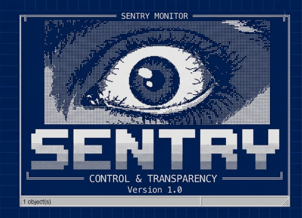
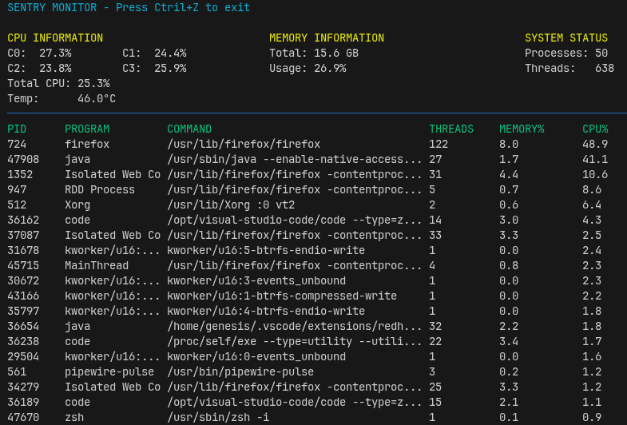

<p align="center">
  
</p>


# sentry

`sentry` is a high‑performance Terminal User Interface (TUI) written in Java that provides real‑time monitoring of Linux system resources and process lifecycles. It acts as a lightweight alternative to `top`/`htop`, leveraging native system APIs via the OSHI library to gather granular hardware metrics and renders them using a console UI built on Lanterna.

## Project Overview

- **Language:** Java 11+
- **Purpose:** Capture and display system metrics (CPU, memory, temperature, processes/threads) in a continuous loop.
- **Architecture:**  
  - **Collectors** (`SystemCollector`, `ProcessCollector`) wrap OSHI calls and maintain tick state to compute deltas.  
  - **Snapshot** (`SystemSnapShot`) aggregates a point‑in‑time view of all metrics.  
  - **Dashboard** builds and updates a Lanterna screen on each snapshot.  
  - **Main** orchestrates the loop, sleeping 2 seconds between renders.
- **Testing:** JUnit 4 tests cover collectors for basic sanity assertions.

## Technologies & Strategies

- **OSHI** – Operating System and Hardware Information library; used for CPU ticks, memory, sensors, and process enumeration.
- **Lanterna** – Java library for building text‑based user interfaces; chosen for portability and simplicity.
- **Immutable Snapshot Pattern** – `SystemSnapShot` is immutable, ensuring consistency across render cycles.
- **Tick‑based Load Calculation** – collectors cache previous CPU tick arrays and compute load between samples for accurate usage percentages.
- **Modular Design** – separation of concerns between data collection and presentation simplifies extension (e.g. add disk or network metrics).
- **Unit Tests** – validate collector outputs are within expected ranges and not negative.
- **Maven** – project build and dependency management via `pom.xml`.

## Usage

You don't need to compile the code to use Sentry. Just follow these steps:

1. **Download:** Go to the [Releases](LINK_PARA_SUA_RELEASE_AQUI) page and download the `sentry-1.3.jar`.
2. **Prerequisites:** Ensure you have **Java 17** (or higher) installed. You can check this by running `java -version` in your terminal.
3. **Run:** Open your terminal in the folder where you downloaded the file and type:
   ```bash
   java -jar sentry-1.3.jar

### What You’ll See



Columns include PID, process name/command, thread count, memory percentage, and CPU percentage.

## Development Notes

- Source files live under `src/main/java/com/sentry`.
- Tests in `src/test/java/com/sentry`.
- Add new metrics by extending the appropriate collector and updating `SystemSnapShot`/`Dashboard`.
- Use `mvn compile` for incremental compilation and `mvn exec:java` to run from source.

## References

- Similar GitHub repos: [jvmtop](https://github.com/patric-r/jvmtop), [ctop](https://github.com/bcicen/ctop) for architectural inspiration.
- OSHI documentation: https://oshi.github.io/oshi/
- Lanterna docs: https://github.com/mabe02/lanterna

Developed by ☕ ***bieldev***.
